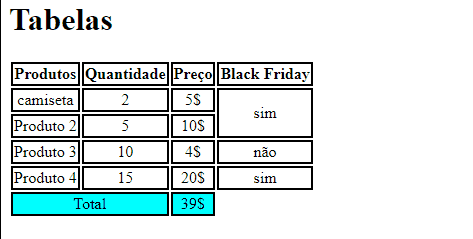

# Projeto de Tabela Simples
Um projeto de tabela simples com um arquivo README.🚀



## Técnologias utilizadas
- HTML
- CSS

## Como utilizar
1-clone o projeto

```
git clone
```

2-acesse a pasta do projeto

```
cd aula-tabela

```